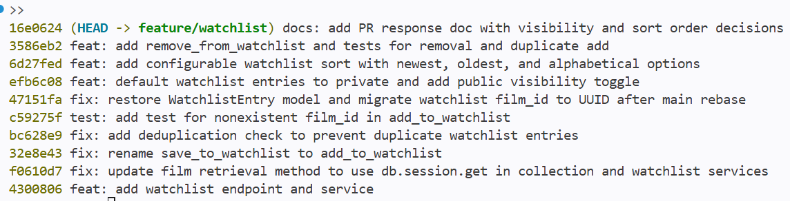

# PR Response Doc: CineLog Watchlist Feature

## AI Usage
I used an AI coding assistant in a few concrete ways during this project.

1. Orientation. I asked it to summarize `models.py`, `services/collection_service.py`, and
   `tests/test_collection.py` so I understood the existing naming and deduplication patterns before I
   touched the watchlist code. I verified each summary against the actual files.
2. Pattern matching. I used it to compare `add_to_collection()` and `remove_from_collection()` so my
   watchlist functions and the new `NotInWatchlistError` followed the same structure.


## Comment 1: Rename
**What I did:**
Renamed `save_to_watchlist()` to `add_to_watchlist()` in `services/watchlist_service.py` so the
watchlist service matches the project verb_to_noun convention used by `add_to_collection()`.

**How I verified:**
Searched the whole project for `save_to_watchlist` to find every call site. The only caller was in
`routes/watchlist/watchlist.py`, which I updated to import and call `add_to_watchlist`. After the
change the project has zero references to the old name, and `pytest tests/ -v` passes.

## Comment 2: Deduplication
**What I did:**
Added a duplicate check to `add_to_watchlist()`. Before inserting, it queries for an existing
`WatchlistEntry` with the same `user_id` and `film_id` and raises `AlreadyInWatchlistError` if one
exists. This mirrors how `add_to_collection()` guards against duplicates in
`services/collection_service.py`.

**How I verified:**
Compared the logic side by side with `add_to_collection()` to confirm the same filter_by and raise
pattern. Confirmed the model also carries a `UniqueConstraint("user_id", "film_id")` as a database
level backstop. `pytest tests/ -v` passes.

## Comment 3: Missing test
**What I did:**
Added `tests/test_watchlist.py` with `test_add_to_watchlist_nonexistent_film_raises`, modeled on
`test_add_to_collection_nonexistent_film_raises` in `tests/test_collection.py`. It uses the same
`app`, `sample_user`, and `sample_film` fixtures and asserts `FilmNotFoundError` is raised.

**How I verified:**
Ran `pytest tests/test_watchlist.py -v` and the full suite `pytest tests/ -v`. All tests pass.

## Comment 4: Default visibility
**My position:**
New watchlist entries should default to private (`public=False`), and users should opt in to make an
entry public. I changed the model default to `False` and added a `public` parameter to
`add_to_watchlist()` and the add endpoint so a caller can share an entry explicitly.

**Reasoning:**
A watchlist shows what a person plans to watch. It reflects their taste, and some users treat it as
personal. Defaulting to visible is a privacy surprise. The safer default is the one that cannot leak
information the user did not choose to share. This follows the principle of least astonishment.
Making sharing an explicit action means visibility is always a conscious choice. CineLog is still a
community app, so I did not remove sharing. I moved it from an automatic default to an opt in through
the `public` parameter. This keeps the social value while putting the user in control.

**Tradeoff acknowledged:**
Defaulting to `public=True` would maximize discovery and the network effect out of the box, which is
part of CineLog's community mission, and a private default means shared watchlists are rarer until
users opt in. I accept that trade because user trust matters more than day one discovery, and the new
`public` toggle keeps the cost of sharing low for anyone who wants it.

## Comment 5: Sort order
**My position:**
Rather than pick one fixed order, I made the sort configurable. `get_watchlist()` now accepts a `sort`
argument and the endpoint accepts a `?sort=` query parameter with three values: `newest` (default),
`oldest`, and `alphabetical`. I set the default to `newest`, which is the maintainer's preference.

**Reasoning:**
A watchlist is a to watch queue, and different users read it differently. Someone who just added a
film expects it near the top (newest first). Someone working through a backlog wants the film they
have waited longest to watch (oldest first). Someone scanning a long list to find a specific title
wants alphabetical. No single order serves all three, so exposing the choice is a better answer than
arguing over one default. The cost is small: it is one dictionary lookup and one query parameter.

**Engagement with reviewer's point:**
The maintainer's core argument is consistency. The watchlist should match `get_collection`, which
sorts by `date_added` descending, and a newly added item belongs at the top. That argument is
correct, so I made `newest` the default. This gives that exact behavior and keeps the two features
consistent out of the box. My original alphabetical sort helped users find a title in long lists, and
I did not want to lose that. So instead of replacing one hard coded order with another, I kept
alphabetical as an option alongside the maintainer's preferred default. This resolves the
disagreement rather than trading one rigid choice for another.

## Comment 6: Rebase
**What conflicted:**
While the PR was open, a refactor merged to main that migrated film IDs from integer to UUID. My
watchlist code still used integer IDs, so the `WatchlistEntry.film_id` column, the service and route
docstrings, and the test fixture all conflicted with the new UUID world on main.

**How I resolved it:**
Rebased `feature/watchlist` onto `origin/main`. During conflict resolution I set
`WatchlistEntry.film_id` to a `db.String(36)` UUID foreign key matching `Film.id`, updated the
service and route docstrings from int to UUID, and changed the test fixture from an integer id to a
UUID string.

**How I verified no conflict remains:**
`git status` reports a clean tree with no conflict markers, `git log --oneline origin/main..HEAD`
shows a linear history with no merge commits, and `pytest tests/ -v` passes.

## Stretch Features

**remove_from_watchlist():**
Added `remove_from_watchlist(user_id, film_id)` to `services/watchlist_service.py`, mirroring
`remove_from_collection()`. It looks up the entry by `user_id` and `film_id`, raises a new
`NotInWatchlistError` if it does not exist, and otherwise deletes it and returns True. This follows
the project's verb_to_noun naming and the same lookup pattern used by the collection service.

**Extra test (my choice of edge case):**
I added `test_add_to_watchlist_duplicate_raises`. I chose the duplicate add case because it directly
exercises the deduplication logic from Comment 2 at the service layer, rather than relying on the
database unique constraint to catch it. If someone later refactors the service and drops the in code
check, this test fails even though the constraint might still exist, so it protects the exact behavior
the reviewer asked for. I also added `test_remove_from_watchlist_removes_entry` and
`test_remove_from_watchlist_not_in_list_raises` to cover the new remove function.

**Visibility toggle:**
Covered under Comment 4. `add_to_watchlist()` and the add endpoint now accept a `public` flag, so a
caller can set visibility explicitly instead of relying on the default.

## PR Description

### What this feature does
This PR adds a watchlist to CineLog, a list of films a user wants to watch later, separate from the
collection of films they have already watched. It includes:

- A `WatchlistEntry` model with a UUID `film_id` foreign key, matching the post refactor schema on
  main, plus a unique constraint on `(user_id, film_id)`.
- `add_to_watchlist(user_id, film_id, public=False)`: adds a film, raises `FilmNotFoundError` if the
  film does not exist and `AlreadyInWatchlistError` if it is already on the list.
- `remove_from_watchlist(user_id, film_id)`: removes a film, raises `NotInWatchlistError` if it is not
  on the list.
- `get_watchlist(user_id, sort="newest")`: returns the list, sorted by `newest`, `oldest`, or
  `alphabetical`.
- Endpoints: `POST /watchlist/<user_id>/add` (accepts `film_id` and an optional `public` flag) and
  `GET /watchlist/<user_id>` (accepts an optional `?sort=` query parameter).

### Design decisions
1. Default visibility. New entries default to private (`public=False`). Users opt in to sharing by
   passing `public=true`. This favors user privacy over automatic discovery. See Comment 4 above.
2. Sort order. Sort is configurable with three options, `newest` (default), `oldest`, and
   `alphabetical`, rather than one fixed order. The default matches how the collection sorts. See
   Comment 5 above.

### How to test it manually
1. Set up and start the app:

   ```
   python -m venv .venv
   .venv\Scripts\activate.bat
   pip install -r requirements.txt
   python app.py
   ```

   The app runs at http://127.0.0.1:5000. There is no admin endpoint for creating users or films, so
   seed one of each first.

2. In a second terminal, open a Python shell and create a user and a film, then note the printed UUIDs:

   ```
   python
   >>> from app import create_app, db
   >>> from models import User, Film
   >>> app = create_app()
   >>> with app.app_context():
   ...     u = User(username="alice", email="alice@example.com")
   ...     f = Film(title="Paddington 2", year=2017, genre="Comedy")
   ...     db.session.add_all([u, f]); db.session.commit()
   ...     print("user_id:", u.id); print("film_id:", f.id)
   ```

3. Add the film to the watchlist (private by default):

   ```
   curl -X POST http://127.0.0.1:5000/watchlist/<user_id>/add -H "Content-Type: application/json" -d "{\"film_id\": \"<film_id>\"}"
   ```

   The response shows `"public": false`. To share on add, pass the flag:

   ```
   curl -X POST http://127.0.0.1:5000/watchlist/<user_id>/add -H "Content-Type: application/json" -d "{\"film_id\": \"<film_id>\", \"public\": true}"
   ```

4. View the watchlist, and try the sort options:

   ```
   curl http://127.0.0.1:5000/watchlist/<user_id>
   curl "http://127.0.0.1:5000/watchlist/<user_id>?sort=oldest"
   curl "http://127.0.0.1:5000/watchlist/<user_id>?sort=alphabetical"
   ```

5. Adding the same film twice returns an error, which confirms deduplication.

6. Run the automated test suite, which does not need seeding since it uses an in memory database:

   ```
   pytest tests/ -v
   ```

   All 8 tests pass.

### Commit history
